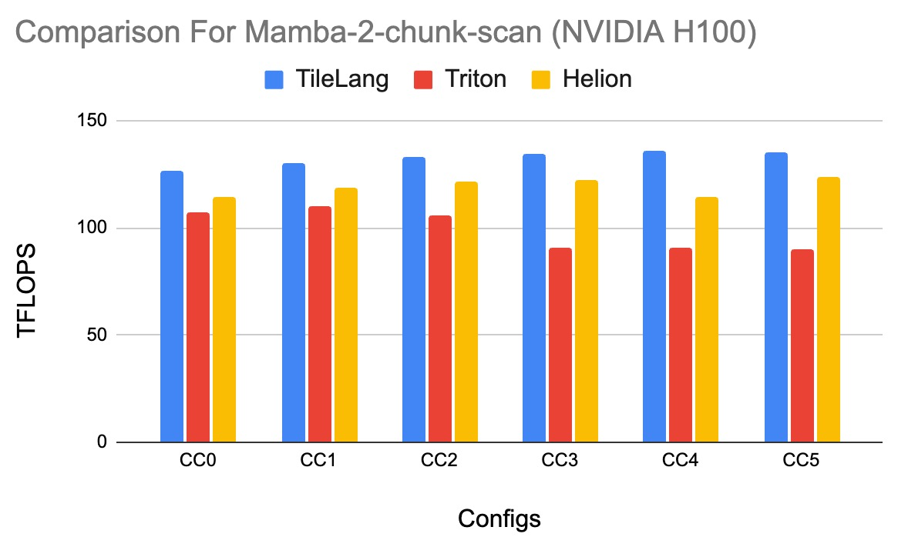

# Mamba2_chunk_scan Benchmark

This document records the throughput achieved by `benchmark_mamba_chunk_scan.py` when computing `batch = 8`, `heads = 80`, `groups = 1`, `chunk_size = 256`, `dim = 64`, and `dstate = 128` across different `seq_len` using the default autotuning search space.

## Environment

- Repository commit: `8a5eb569704bfea64478c29adcfe3a09e3c2b12c`
- GPUs: `NVIDIA H800 SXM` on driver `560.35.05`

## How to Reproduce

```bash
cd benchmark/mamba2
python - <<'PY'
from benchmark_mamba_chunk_scan import chunk_scan_fwd

batch = 8
heads = 80
groups = 1
chunk_size = 256
dim = 64
dstate = 128
for seq_len in [1024, 2048, 4096, 8192, 16384, 32768]:
    res = chunk_scan_fwd(
            batch,
            seq_len,
            chunk_size,
            groups,
            heads,
            dim,
            dstate)
    tflops = (2 * batch * seq_len * chunk_size * heads * dim * 0.5 + 2 * batch * seq_len * heads * dim * dstate) / res.latency * 1e-9
    print(f"seq_len={seq_len:5d}  latency={res.latency:.6f}ms  TFlops={tflops:.3f}")
PY
```

## Results

| Seq_len| Latency (ms) | Throughput (TFLOPs) |
|-------|-------------|---------------------|
|  1024 | 0.169    | 126.477                 |
|  2048 | 0.329    | 130.195                 |
|  4096 | 0.645    | 133.054                 |
|  8192 | 1.278    | 134.362                 |
| 16384 | 2.531    | 135.711                 |
| 32768 | 5.076    | 135.379                 |

## Compare with Baselines

- Triton: v3.5.0, mamba-ssm: v2.2.6.post3
- Helion: v0.2.1

<figure style="text-align: center">
  <a href="mamba_benchmark_result.png">
    
   </a>
  <figcaption style="text-align: center;">Performance comparison across compilers on NVIDIA H100</figcaption>
</figure>
