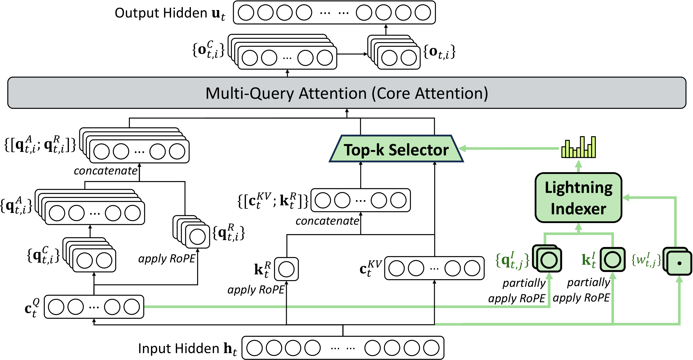

## Directory Structure

```
deepseek_v32/
├── README.md                           # This file
├── figures/                            # Figures and diagrams
├── inference/                          # Inference implementation folder
├── fp8_lighting_indexer.py             # FP8 lighting indexer
├── sparse_mla_bwd.py                   # Sparse MLA backward implementation
├── sparse_mla_fwd.py                   # Sparse MLA forward implementation
├── sparse_mla_fwd_pipelined.py         # Pipelined implementation of sparse MLA forward pass
├── topk_selector.py                    # Top-k selector implementation
```

## File Descriptions

### Architecture Overview



The architecture diagram above highlights three key components (shown in green) that correspond to our kernel implementations:

1. **Lightning Indexer** (`fp8_lighting_indexer.py`) - Efficiently indexes and processes sparse attention patterns using FP8 precision
2. **Top-k Selector** (`topk_selector.py`) - Selects the top-k most relevant tokens for sparse attention computation
3. **Multi-Query Attention** (`sparse_mla_fwd.py`, `sparse_mla_fwd_pipelined.py`, and `sparse_mla_bwd.py`) - Core attention mechanism implementation with sparse MLA (Multi-Latent Attention) forward and backward passes

### Lightning Indexer

Looking at the architecture diagram, the Lightning Indexer sits at the bottom right. It takes the input hidden states and produces compressed representations `{q^A_{t,i}}`, `{k^R_t}`, and `{w^I_{t,j}}`. These FP8-quantized index vectors are what feed into the top-k selector.

The main kernel `mqa_attn_return_logits_kernel` computes similarity scores between query and key indices:

```python
T.gemm(
    index_k_shared,
    index_q_shared,
    s,
    transpose_B=True,
    clear_accum=True,
    policy=T.GemmWarpPolicy.FullCol,
)
```

After the matmul, we apply ReLU and aggregate across heads with learned weights:

```python
for bn_i, bq_i, h_i in T.Parallel(block_N, block_Q, heads):
    s_reshaped[bn_i, bq_i, h_i] = (
        T.max(s[bn_i, bq_i * heads + h_i], 0) * weights[bq_i, h_i]
    ) * index_k_scale_fragment[bn_i]

T.reduce_sum(s_reshaped, logits, dim=-1, clear=True)
```

The result is a `[seq_len, seq_len_kv]` logits matrix. For long sequences, the kernel uses per-token bounds (`CuSeqLenKS`, `CuSeqLenKE`) to skip irrelevant KV positions:

```python
for bq_i in T.serial(block_Q):
    cu_k_s_min[0] = T.min(cu_k_s_min[0], T.min(CuSeqLenKS[seq_len_i + bq_i], seq_len_kv))
for bq_i in T.serial(block_Q):
    cu_k_e_max[0] = T.max(cu_k_e_max[0], T.min(CuSeqLenKE[seq_len_i + bq_i], seq_len_kv))
```

The pipelined loop then only processes keys in the `[cu_k_s_min, cu_k_e_max)` range, which is crucial for handling variable-length sequences in distributed training.

### Top-k Selector

The Top-k Selector takes the logits matrix from the indexer and picks the top-k indices for each query. In the architecture diagram, this sits between the Lightning Indexer and the Multi-Query Attention block. The output indices tell the attention layer which KV tokens to actually load and process.

The implementation uses a radix-sort-based approach that processes floats as unsigned integers. Stage 1 does a quick 8-bit pass over the whole sequence:

```python
for s in T.serial(T.ceildiv(seq_len, BLOCK_SIZE)):
    input_idx = s*BLOCK_SIZE+tx
    if input_idx < l_end_idx and input_idx >= l_start_idx and input_idx < seq_len:
        inval_int16 = convert_to_uint16(input[bx, input_idx])
        T.atomic_add(s_histogram[inval_int16], 1)
```

The `convert_to_uint16` function maps floats to uint16 such that larger floats map to larger integers. After building a histogram and doing a cumulative sum, we find the threshold bin:

```python
if s_histogram[tx] > l_new_topk and s_histogram[tx + 1] <= l_new_topk:
    s_threshold_bin_id[0] = tx
```

Elements above the threshold go directly to the output. Elements in the threshold bin get collected for further processing:

```python
if l_bin_id32 > l_threshold_bin_id:
    pos = T.atomic_add(s_histogram[l_bin_id32+1], 1, return_prev=True)
    index[bx, pos] = input_idx
elif l_bin_id32 == l_threshold_bin_id and l_new_topk > 0:
    pos = T.atomic_add(s_num_input[0], 1, return_prev=True)
    s_input_idx[0, pos] = input_idx
```

Stage 2 refines the threshold bin with up to 4 rounds of 8-bit radix sort, processing progressively higher bits. This gives exact top-k selection without sorting the entire sequence.

### Sparse MLA Forward

The Sparse MLA kernel is where the actual attention computation happens. In the architecture diagram, this is the large "Multi-Query Attention (Core Attention)" block at the top. It takes the selected top-k indices and computes attention only over those tokens.

Turning dense MLA into sparse MLA requires surprisingly few changes - essentially just modifying how we iterate and load KV tokens. The key difference from dense MLA (see `../deepseek_mla/example_mla_decode.py`) is the iteration pattern. Dense MLA iterates over all KV positions:

```python
# Dense MLA: iterate over full sequence
loop_range = T.ceildiv(seqlen_kv, block_N)
for k in T.Pipelined(loop_range, num_stages=2):
    T.copy(KV[bid, k * block_N:(k + 1) * block_N, cur_kv_head, :], KV_shared)
    # ... compute attention over this block
```

Sparse MLA only loads KV positions selected by the top-k selector:

```python
# Sparse MLA: iterate over selected indices only
for i_i in T.Pipelined(NI, num_stages=num_stages):
    for bi_i, d_i in T.Parallel(BI, D):
        KV_shared[bi_i, d_i] = KV[b_i, Indices[b_i, s_i, g_i, i_i * BI + bi_i], g_i, d_i]
    # ... compute attention over selected tokens
```

This reduces compute from O(seq_len *seq_len_kv) to O(seq_len* topk). The causal mask is enforced by checking whether each index position is valid:

```python
for bi_i in T.Parallel(BI):
    mask[bi_i] = Indices[b_i, s_i, g_i, i_i * BI + bi_i] <= max_kv_i
```

Beyond this sparse indexing, the rest of the attention computation (online softmax, output accumulation) follows the same pattern as dense MLA.

### Sparse MLA Forward (Pipelined)

The pipelined version (`sparse_mla_fwd_pipelined.py`) is a manual pipeline implementation designed to match the schedule of [FlashMLA](https://github.com/deepseek-ai/FlashMLA/blob/main/csrc/sm90/prefill/sparse/fwd.cu). It achieves close to 600 TFlops on H800 SXM by carefully orchestrating memory and compute pipelines.

The key difference is splitting the warp groups into specialized roles:

```python
if tx < 128:
    # Consumer 0: computes left half of output (D//2 dimensions)
    # Handles QK matmul, softmax, and PV for left half

elif tx >= 128 and tx < 256:
    # Consumer 1: computes right half of output (D//2 dimensions)
    # Only does PV matmul for right half

elif tx >= 256:
    # Producer: loads KV data from global memory
    # Uses async copy with barriers to feed consumers
```

The producer thread group (tx >= 256) uses double buffering with barriers to keep consumers fed:

```python
# Producer alternates between two buffers
for i_i in T.serial(T.ceildiv(NI, 2)):
    # Buffer 0
    T.barrier_wait(bar_k_0_free[0], ((i_i & 1) ^ 1))
    # ... load KV into buffer 0
    T.cp_async_barrier_noinc(bar_k_0_ready[0])

    # Buffer 1
    T.barrier_wait(bar_k_1_free[0], ((i_i & 1) ^ 1))
    # ... load KV into buffer 1
    T.cp_async_barrier_noinc(bar_k_1_ready[0])
```

Consumer threads wait on barriers and process buffers as they become ready. This manual orchestration hides memory latency behind compute, which is why it outperforms the simpler auto-pipelined version. The output dimension is also split in half so that the two consumer groups can work in parallel on different parts of the matmul.

### Sparse MLA Backward

The Sparse MLA backward kernel (`sparse_mla_bwd.py`) computes gradients with respect to queries (dQ) and key-values (dKV) for the sparse attention mechanism. Like the forward pass, it processes only the selected top-k indices, maintaining O(seq_len * topk) complexity.

The backward pass consists of three main stages:

**1. Preprocessing**: Computes delta values (row-wise dot products of output and output gradient):

```python
for k in T.Pipelined(T.ceildiv(D, block_ND), num_stages=num_stages):
    T.copy(O[bz, by * block_ND:(by + 1) * block_ND, bx, k * block_ND:(k + 1) * block_ND], o)
    T.copy(dO[bz, by * block_ND:(by + 1) * block_ND, bx, k * block_ND:(k + 1) * block_ND], do)
    for i, j in T.Parallel(block_ND, block_ND):
        acc[i, j] += o[i, j] * do[i, j]
T.reduce_sum(acc, delta, 1)
```

**2. Main Backward Computation**: Computes gradients through sparse attention:

```python
# Sparse MLA backward: iterate over selected indices only
for i_i in T.Pipelined(NI, num_stages=num_stages):
    # Load KV data for selected indices
    for bi_i, d_i in T.Parallel(BI, D):
        KV_shared[bi_i, d_i] = KV[by, Indices[by, s_i, bz, i_i * BI + bi_i], bz, d_i]

    # Recompute attention scores for backward
    T.gemm(Q_shared, KV_shared, acc_p, transpose_B=True, policy=T.GemmWarpPolicy.FullCol)

    # Apply softmax gradient: dP = P * (dP_raw - Delta)
    for h_i, bi_i in T.Parallel(padded_H, BI):
        acc_dp[h_i, bi_i] = acc_p[h_i, bi_i] * (acc_dp[h_i, bi_i] - Delta[by, s_i, bz * padded_H + h_i]) * sm_scale
```

The key gradient computations are:
- **dQ = dP @ K** (query gradients)
- **dK = dP^T @ Q** (key gradients)
- **dV = P^T @ dO** (value gradients)

**3. Atomic Sparse Updates**: Uses atomic operations for dKV accumulation:

```python
# Atomically update dKV at selected indices
for bi_i, d_i in T.Parallel(BI // split_store, D // 4):
    T.atomic_addx4(dKV[by, Indices[by, s_i, bz, i_i * BI + bi_i + s * (BI // split_store)], bz, d_i * 4],
                   acc_dkv_shared[bi_i, d_i * 4])
```

**Performance**: The sparse MLA backward achieves excellent performance:
- **H800 SXM**: ~100 TFlops
- **H200 SXM**: ~115 TFlops

The implementation efficiently handles the irregular memory access patterns inherent in sparse attention while maintaining high compute utilization through careful memory management and atomic update strategies. Note that this is a relatively naive implementation that requires further optimization.
